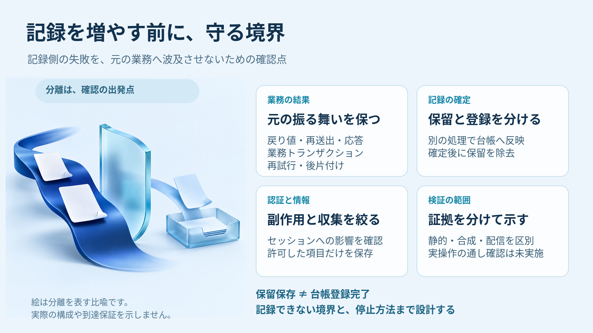
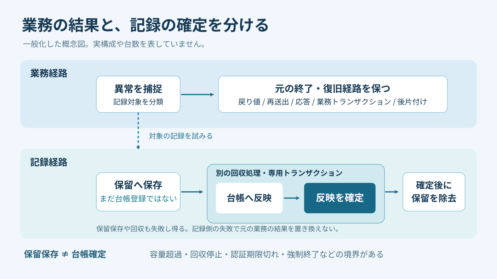

例外を捕まえて、エラーログを増やす。それだけなら、小さな変更に見えます。ただ、記録先が止まったときまで考えると、確認する範囲は広がります。戻り値が変わらないか。元の例外が別の例外に置き換わらないか。業務トランザクションや認証に影響しないか。

今回は、捕捉した異常を不具合台帳へつなぐ経路を整理しました。画面、サーバー、定期処理を調べると、例外を捕捉して終了や復旧を行っていても、台帳への記録につながっていない箇所がありました。そこへ記録を追加する際に考えた、業務処理を守るための設計と確認点をまとめます。

## まずは変えてはいけない振る舞いを並べる

記録を足す前に、既存の例外処理が何をしているかを確かめます。確認したのは、次の点です。

- 元の戻り値と、利用者や呼び出し元への応答
- 例外を再送出するか、復旧して処理を終えるか
- 業務トランザクションの確定と取り消し
- 再試行の条件と、後片付けが行われる順序

たとえば、もともと例外を再送出する経路なら、記録を追加したあとも、その業務上の失敗は呼び出し元へ伝える必要があります。記録処理の失敗を抑えるつもりで広い範囲を捕捉し、元の失敗まで成功として返してしまうと、業務ロジックの意味が変わります。

`throw`、`return`、`transaction` の位置と順序は、記録を差し込む都合で動かさないようにします。後片付けを含め、変更前に通っていた経路が変更後も保たれるかを見ます。「ログを一行足しただけ」という見積もりで、この確認を省かないことが出発点でした。

## 捕捉した場所では保留し、別の処理で台帳へ反映する

業務の途中で台帳への反映まで行うと、記録側の失敗を業務側が受ける接点が増えます。そこで、捕捉時には保留領域へ保存し、別の回収処理が台帳へ反映する形に分けました。

回収処理は、業務処理とは別の専用トランザクションを使います。台帳への反映が確定してから、その保留データを取り除きます。記録がまだ確定していないのに保留データを先に消さない、という順序を明確にしました。

業務経路では元の戻り値、再送出、応答を保ち、記録経路では保留、回収、台帳への確定を扱います。保留保存の時点では登録完了とせず、台帳への反映が確定したあとに保留データを取り除きます。

この分離は、記録処理の失敗が元の業務へ波及するのを抑えるためのものです。保留領域への保存そのものも失敗し得るので、単に保存先を移せば安全になるわけではありません。台帳への反映に失敗した場合と、保留すらできなかった場合は、確認すべき境界が違います。

見直すときは、業務側のトランザクションと、台帳側のトランザクションを別々にたどります。どちらの確定を待っているのか、どちらが失敗したときの処理なのかを明確にします。記録処理を切り出していても、最後に元の業務の結果を書き換えてしまえば、分離の目的を満たせません。

また、保留保存を「不具合台帳に登録できた」と説明しないようにします。保留と確定を同じ成功にまとめると、回収処理が止まったときに、どこまで進んだのかを誤って判断しやすくなります。設計の説明にも確認結果にも、この区別を残します。

## 自動報告でセッションの動きを変えない

画面からの自動報告では、通常の操作と同じ経路を使ったときの副作用も確認しました。自動報告によって、通常の認証セッションや最終操作時刻の更新へ影響が出ないよう、経路を分離しています。

ここでは「報告が届いたこと」と「利用者が操作したこと」を区別する必要があります。自動で動く記録処理を追加するときは、保存先だけでなく、その手前で共通に呼ばれる処理まで確認します。

長い保存処理へ入る前には、セッションのロックを解放します。記録を残すための待ち時間が、セッションを使うほかの処理へ広がらないようにするためです。これも、記録側を専用トランザクションに分けるだけでは確認し切れない点でした。

## 保存する項目は許可リストで決める

自動記録では、調査に使えそうな情報を広く集める前に、保存してよい項目を決めました。扱うのは、異常の分類、発生箇所、関連づけに必要な識別情報です。

例外の生メッセージ、SQL、入力本文、Cookie、引数は保存しません。対象外の情報をあとから削る方式よりも、収集できる項目を許可リストで限定する方針にしました。

保存するのは分類、発生箇所、関連づけ用の識別情報で、入力本文などは対象から外します。許可した情報だけをふるいに通す比喩で、収集範囲を絞る考え方を示しています。

確認したいのは、項目名が決まっていることだけではありません。その項目に何を入れるかも含めて見ます。分類や発生箇所を残す設計なのに、値として生の例外メッセージを渡していれば、収集範囲を限定したことになりません。

関連づけ用の識別情報も、調査に必要な範囲で扱います。記事や図では実際の値を示さず、概念として説明します。記録を充実させる判断と、保存してよい情報を増やす判断を、ひとまとめにしないようにしました。

## 通常の失敗まで不具合にしない

台帳につながっていない経路を探す作業では、何を記録しないかも整理しました。想定された入力不備、権限拒否、通常の業務上の競合、利用者による取消を、一律に不具合として扱うことはしません。

例外が発生したという形だけで判断すると、通常の制御として扱っている結果まで、調査対象に混ざります。記録対象と、その対象から外す理由を合わせて整理しておくと、後から経路を追加する際にも判断を引き継ぎやすくなります。

除外理由は、単に「記録しない」とだけ残さず、想定された業務上の結果として扱う理由を整理します。一方、記録する経路については、どの分類で、どの発生箇所を残すかを確認します。こうすると、対象の選び方と収集項目の選び方を合わせて点検できます。

逆に、例外を投げない失敗や、処理が未完了のまま終わる場合も検討対象です。`catch` を探して記録を足す作業だけでは、異常の網羅を確認したことにはなりません。終了や復旧の経路を見直すときは、例外の有無だけでなく、処理がどういう結果で終わるかを確かめます。

## テストで確かめたことを分けて書く

確認には、静的検査、合成データと代替依存を使った失敗注入、CIを用いました。記録側が失敗する条件を作り、元の戻り値、再送出、応答、トランザクション、再試行、後片付けが変わらないかを確認しています。

その後、ソースの配信先でファイルが一致していることを確認し、現行仕様へ反映しました。ただし、配信したファイルの一致から、実際の業務動作や台帳への到達が成功したとは言えません。確認の種類ごとに、分かったことを分けておきます。

- 静的検査では、ソース上の記録経路や変更内容を確認する
- 合成データと代替依存の検査では、用意した条件での振る舞いを確認する
- 配信後のファイル照合では、対象のファイルが一致していることを確認する
- 実操作の通し確認では、実画面から実台帳までの到達を確認する

**今回、最後の実操作の通し確認は実施していません。** ブラウザ確認、スモークテスト、検証用の実データ投入も確認範囲外です。CIで確認したことを、そのまま実環境での成功へ読み替えないようにします。

失敗注入の結果を見るときも、「記録に失敗した」という結果だけで終えず、そのとき業務側がどう終わったかを確かめます。再送出するはずの例外が伝わるか、戻り値が置き換わっていないか、必要な後片付けが残っているか。最初に並べた変更してはいけない振る舞いを、そのまま検査の観点として使います。

確認済みの範囲と未確認の範囲を並べておくと、次に必要な検証も見えます。記録経路を足したこと、合成条件で確かめたこと、実際に台帳へ届いたことは、それぞれ別の結果です。

## 記録できない境界まで含めて設計する

保留と回収を分けても、すべての異常が必ず記録される保証はできません。容量超過、回収処理の停止、認証期限切れ、強制終了など、記録できない境界があります。保留領域を持つ設計でも、未完了の記録が残る可能性を含めて考えます。

そのため、重複抑制だけでなく、容量上限、回収量の上限、保持の扱い、停止方法を設計しました。ためられる量と、一度に回収する量は別に考えます。記録を増やす変更には、増え続けないための条件と、止めるための条件も必要です。

保持や停止方法も、保留データの扱いと合わせて確認します。回収を止めたあとに何が残るか、保存領域が使えないときにどこまで記録できるかを、通常の経路と切り分けて考えます。運用上の境界を伏せたまま「記録できる」とだけ説明しないことが大切です。

重複を抑える仕組みがあっても、無条件に一度だけ記録される、いわゆる exactly-once を保証するものではありません。また、ログアウトすれば常にローカル保存が消えるとも断定しません。異常終了や保存領域の失敗は、通常の終了手順とは分けて考える必要があります。

ログを足したあとの影響が完全にゼロだと言い切ることもできません。何を分離し、どの失敗を試し、どこが未確認なのか。その範囲を具体的に説明できる状態を目指します。

関連する考え方として、[UIフリーズを追うログは、リリース前にパージできる形で仕込む](https://zenn.dev/ishizakahiroshi/articles/20260927-ui-freeze-instrumentation-purge)でも、ログの副作用、入力本文を集めない方針、確認範囲の区別を扱っています。

例外ログを増やすときは、台帳への接続点だけでなく、戻り値や再送出、認証、保存項目、回収の上限まで見直します。業務処理の意味を保ったまま、調査に必要な記録を残す。そのための境界を先に決めておくと、記録の追加と検証を同じ基準で進められます。

---

※ ヘッダー画像とインフォグラフィックの絵は AI（画像生成）で作成しています。

※ 本文の挿絵も AI（画像生成）で作成しています。

書いた人: ishizakahiroshi
群馬の北部で、保護猫2匹と暮らす、在宅エンジニア（何でも屋）
https://ishizakahiroshi.com/
https://github.com/ishizakahiroshi
X（業務委託・各種相談はこちら）：
https://x.com/ishizakahiroshi

バックエンド・インフラ・AI連携まわりで、業務委託のご相談を受け付けています。フルリモートです。スポットや週2〜3時間からでも歓迎で、いろんな案件に携われたらうれしいです。こんな相談、歓迎です。
